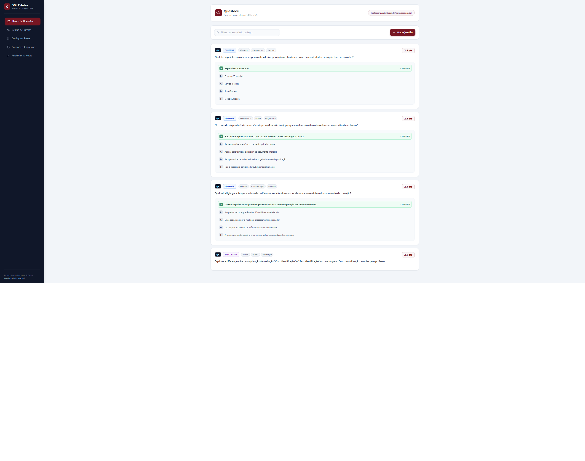
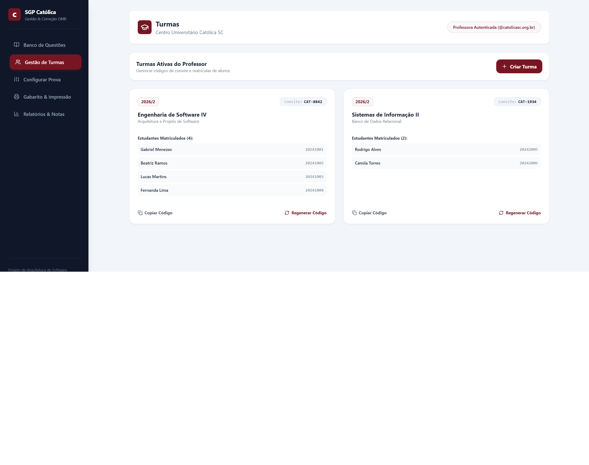
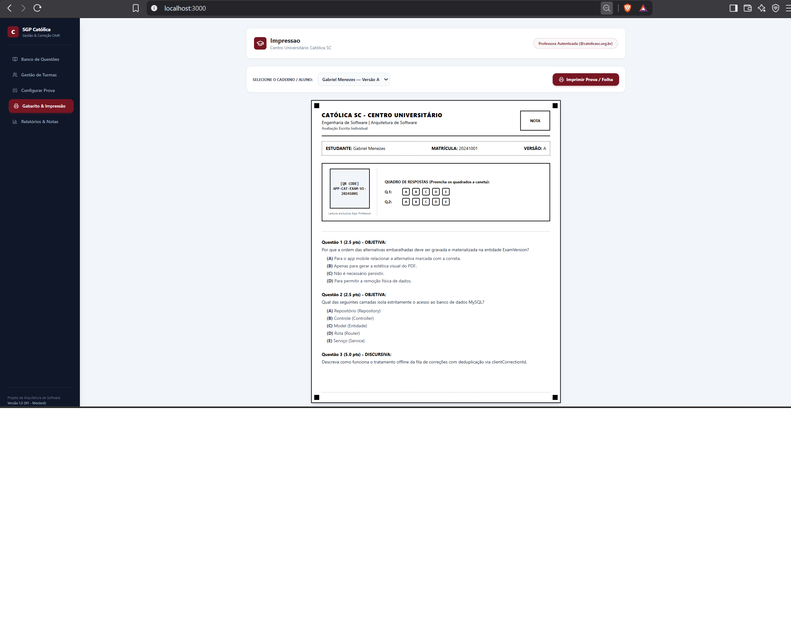
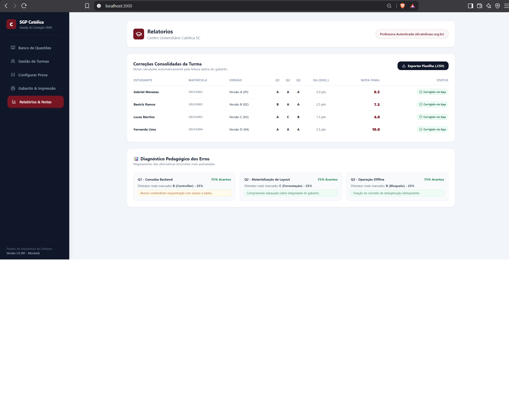

<div align="center">

#  SGP - Sistema de Geração e Correção de Provas

**Plataforma web componentizada para criação flexível de avaliações, embaralhamento dinâmico de versões, impressão de caderno frente e verso com folha de respostas OMR destacável e correção automatizada via leitura de QR Code.**

 **Link do sistema hospedado:** https://sgp-catolica-next.vercel.app/


</div>

---

##  Equipe

| Nome completo | Papel / Principais frentes no projeto |
|---|---|
| **Agenor Alvise** | Front-end das telas de aplicação, diagramação para impressão frente/verso, gabaritos OMR, testes unitários com Jest e pipeline de CI/CD |
| **Johnatan Vargas da Fonseca** | Front-end do módulo de turmas, banco de questões e manipulação de mocks de dados |
| **Eric Ricardo Lange** | Modelagem das entidades de dados, regras de validação de formulários e mapeamento de componentes |
| **Erick Andreas Pontecelli** | Estruturação dos algoritmos de embaralhamento determinístico e matrizes de resposta OMR |
| **Edinei Junio Machado** | Levantamento de requisitos com o cliente Samuel, arquitetura em camadas, documentação e gestão do Git |

---

##  Sumário

- [1. Visão Geral e Objetivo](#1-visão-geral-e-objetivo)
- [2. Escopo do Projeto](#2-escopo-do-projeto)
- [3. Requisitos do Sistema](#3-requisitos-do-sistema)
- [3.1 Requisitos Funcionais (RF)](#31-requisitos-funcionais-rf)
- [3.2 Requisitos Não Funcionais (RNF)](#32-requisitos-não-funcionais-rnf)
- [4. Telas do Sistema](#4-telas-do-sistema)
- [5. Stack Tecnológica](#5-stack-tecnológica)
- [6. Estrutura de Pastas](#6-estrutura-de-pastas)
- [7. Como Executar o Projeto](#7-como-executar-o-projeto)
- [8. Testes e CI/CD](#8-testes-e-cicd)
- [9. Equipe e Contribuições](#9-equipe-e-contribuições)

---

## 1. Visão Geral e Objetivo

### Contexto e Cliente
O **SGP (Sistema de Geração e Correção de Provas)** foi concebido para atender às demandas do docente **Samuel** e do corpo acadêmico do Centro Universitário Católica SC, eliminando a sobrecarga de trabalho manual na aplicação e correção de grandes volumes de avaliações (200 a 400 provas por ciclo).

### Objetivo
Automatizar integralmente o fluxo avaliativo institucional:
1. **Montagem Flexível:** Composição de provas com banco de até 20 questões e pontuações personalizadas.
2. **Diagramação e Impressão Inteligente:** Geração de cadernos de questões em formato **frente e verso** acompanhados de folha de respostas/gabarito OMR destacável com inserção de página em branco no verso (em caso de página ímpar), permitindo que o aluno entregue apenas o gabarito e leve o caderno para casa.
3. **Embaralhamento Determinístico:** Alternância independente da ordem de questões e alternativas por versão.
4. **Correção e Diagnóstico Pedagógico:** Leitura automatizada via QR Code e processamento no backend de estatísticas de erros/acertos, diagnóstico de distratores e acompanhamento contínuo de notas (N1, N2 e N3).

---

## 2. Escopo do Projeto

### O que está no escopo:
* **Banco de Questões e Provas:** Cadastro e manutenção de questões objetivas (2 a 5 alternativas) e discursivas.
* **Gestão de Turmas e Matrículas:** Administração de turmas ativas com auto-matrícula por código de convite (`inviteCode`).
* **Motor de Impressão e Paginação:**
  * Diagramação do caderno de questões frente e verso para o aluno levar para casa.
  * Folha de respostas/gabarito OMR gerada separadamente do caderno.
  * Inserção automática de página em branco no verso do gabarito caso o número de páginas seja ímpar.
* **Embaralhamento e QR Code:** Embaralhamento independente de questões e alternativas por versão com persistência da matriz de layout e QR Code nominal ou anônimo.
* **Módulo Estatístico e Relatórios:**
  * Métricas de acertos e erros gerais calculadas no backend por questão.
  * Diagnóstico pedagógico das alternativas incorretas mais marcadas (análise de distratores).
  * Histórico contínuo de notas por aluno discriminado por avaliação e etapas (N1, N2 e N3).
  * Exportação de notas e dados em arquivo `.csv`.

---

## 3. Requisitos do Sistema

### 3.1 Requisitos Funcionais (RF)

| Código | Requisito |
|---|---|
| **RF01** | O sistema deve autenticar usuários separando domínios institucionais: docentes (`@catolicasc.org.br`) e estudantes (`@catolicasc.edu.br`). |
| **RF02** | O sistema deve permitir o gerenciamento de questões objetivas (2 a 5 alternativas) e discursivas com pontuações personalizadas. |
| **RF03** | O sistema deve permitir a criação de turmas com código de convite (`inviteCode`) auto-regenerável para auto-matrícula. |
| **RF04** | O sistema deve permitir a composição de provas com até 20 questões. |
| **RF05** | O sistema deve aplicar embaralhamento determinístico e independente para questões e alternativas por versão gerada. |
| **RF06** | O sistema deve materializar e persistir no banco de dados a matriz de layout de cada versão (`ExamVersion.layout`). |
| **RF07** | O sistema deve gerar a folha de respostas/gabarito OMR separada do caderno descritivo de questões. |
| **RF08** | O sistema deve diagramar o caderno de questões em formato frente e verso para que o estudante possa levá-lo após a prova. |
| **RF09** | O motor de impressão deve inserir automaticamente uma página em branco após o gabarito se este ocupar página ímpar. |
| **RF10** | A folha de respostas deve conter marcadores de calibração nos cantos e QR Code identificador (nominal ou anônimo). |
| **RF11** | O backend deve processar e calcular estatísticas gerais de acertos e erros por questão. |
| **RF12** | O sistema deve identificar o distrator mais assinalado em cada questão para diagnóstico pedagógico docente. |
| **RF13** | O sistema deve manter o histórico evolutivo de notas do aluno por prova e por etapa avaliativa (N1, N2 e N3). |
| **RF14** | O sistema deve suportar exportação de notas e relatórios em arquivo `.csv`. |
| **RF15** | O sistema deve garantir a anonimização de dados sob demanda em conformidade com a LGPD. |

### 3.2 Requisitos Não Funcionais (RNF)

| Código | Requisito |
|---|---|
| **RNF01** | **Arquitetura em 5 Camadas:** O backend segue o fluxo estrutural `Rota → Controle → Serviço → Repositório → Model`. |
| **RNF02** | **Desempenho:** Tempo de resposta da API p95 < 300ms. |
| **RNF03** | **Disponibilidade:** Mínimo de 99,5% de disponibilidade mensal. |
| **RNF04** | **Operação Offline:** Suporte a cache de gabarito e sincronização idempotente via `clientCorrectionId`. |
| **RNF05** | **Confiabilidade OMR:** Taxa de erro na leitura óptica inferior a 1% sob condições regulares. |
| **RNF06** | **Segurança:** Isolamento estrito de acesso e visualização de notas entre estudantes. |

---

## 4. Telas do Sistema

### 4.1 Banco de Questões

*Listagem de questões cadastradas com filtros por enunciado/tags, badges e pontuações individuais.*

### 4.2 Gestão de Turmas

*Administração de turmas ativas, estudantes matriculados e código de convite institucional.*

### 4.3 Configuração da Prova & Montador Split-Screen

*Painel de parametrização de versões, regras de embaralhamento, paginação e cálculo de nota em tempo real.*

### 4.4 Folha de Resposta & Gabarito OMR

*Layout de impressão com marcadores de calibração, QR Code nominal e caderno descritivo frente/verso.*

### 4.5 Relatório de Notas, Distratores e Histórico N1/N2/N3

*Consolidação de notas corrigidas, exportação em `.csv`, diagnóstico de distratores e evolução semestral.*

---

## 5. Stack Tecnológica


* **Next.js 14 (App Router):** Framework React full-stack para interfaces e rotas server-side.
* **TypeScript:** Tipagem estática em modelos de domínio, layouts e serviços.
* **Tailwind CSS:** Design system responsivo com regras utilitárias para impressão física (`@media print`).
* **Jest & Testing Library:** Execução de testes unitários automatizados.
* **Lucide React:** Biblioteca de ícones utilitários minimalistas.

---

## 6. Estrutura de Pastas

```text
sgp-catolica-next/
├── .github/
│   └── workflows/                 # Fluxos de CI/CD do GitHub Actions
├── docs/
│   └── telas/                     # Capturas de tela da aplicação
├── src/
│   ├── app/
│   │   ├── api/exams/generate/
│   │   │   └── route.ts           # Rota de API para geração de versões
│   │   ├── globals.css            # Estilos globais e regras de impressão
│   │   ├── layout.tsx             # Layout raiz da aplicação
│   │   └── page.tsx               # Página principal da aplicação
│   ├── components/
│   │   ├── auth/                  # Componentes de autenticação
│   │   ├── layout/                # Cabeçalho e navegação
│   │   └── omr/                   # Renderização da folha OMR
│   ├── controllers/               # Controle e validação de requisições
│   ├── models/                    # Entidades e modelos de domínio
│   ├── repositories/              # Acesso e abstração de dados
│   ├── services/                  # Regras de negócio e embaralhamento
│   └── types/                     # Interfaces e contratos TypeScript
├── __tests__/
│   └── services/
│       └── ExamService.test.ts    # Testes unitários com Jest
├── jest.config.js                 # Configuração do Jest
├── package.json                   # Dependências e scripts do projeto
└── README.md
```


---

## 7. Como Executar o Projeto

### Pré-requisitos
* Node.js v20.x ou superior instalado.
* NPM (gerenciador de pacotes).

### Passos de Instalação

1. Clone o repositório ou acesse a pasta raiz do projeto.
2. Instale as dependências:

   ```bash
   npm install
   ```

3. Inicie o servidor de desenvolvimento:

   ```bash
   npm run dev
   ```

4. Acesse [http://localhost:3000](http://localhost:3000) no navegador.

---

## 8. Testes e CI/CD

O projeto conta com testes unitários para as regras centrais de negócio do `ExamService`, incluindo o limite de 20 questões por prova, o payload de identificação do QR Code e a integridade do embaralhamento.

```bash
# Executar todos os testes
npm test

# Executar testes com relatório de cobertura
npm run test:coverage
```

A esteira de integração contínua (CI/CD) via GitHub Actions é executada a cada *push* ou *pull request* na branch `main` e valida:

* Instalação das dependências (`npm install`);
* Execução da suíte de testes unitários com Jest;
* Compilação da build de produção do Next.js (`npm run build`).

---

## 9. Equipe e Contribuições

As contribuições e principais frentes de cada integrante estão descritas na seção [Equipe](#equipe).
